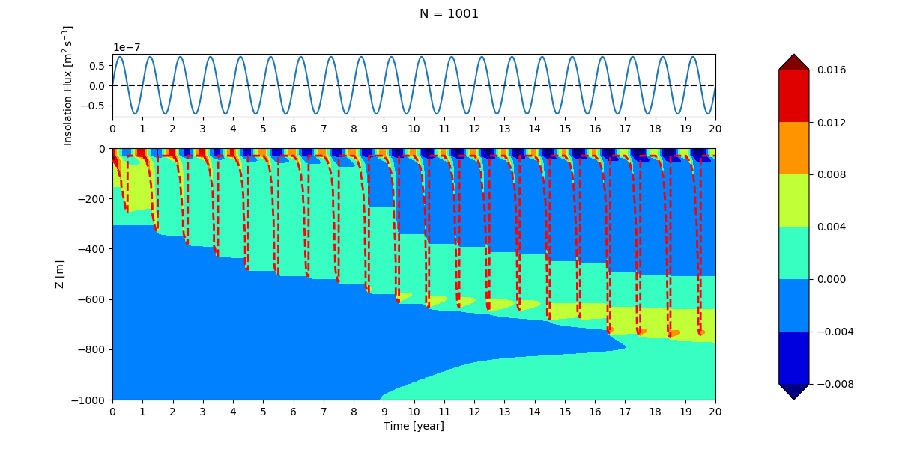

# SMARTSLAB

This project aims to parameterize mixed-layer depth (MLD) in a way that is efficient for climate models to simulate ocean mixed-layer response in timescale of decades.

## General information

Notes, working progress, references... etc. are in `notes`.
Codes are in `src` with each experiment described as sections below.
The current coupled model that I am using is [GFDL ESM2G](https://www.gfdl.noaa.gov/earth-system-model/). The experiment they run is the historical (145 years) run for [CMIP5](https://cmip.llnl.gov/cmip5/) where the data is downloaded from [ESGF](https://esgf-node.llnl.gov/projects/cmip5/).

## Target Models

- [GFDL ESM2G](https://www.gfdl.noaa.gov/earth-system-model/)
- [EC-Earth](http://www.ec-earth.org/)
- [NCAR CESM](http://www.cesm.ucar.edu/experiments/cesm1.0/)

## Latest work (partial text of [progress](./notes/01-progress.md)) 

# 2019-01-14
- Complete a crude mixed layer model MLMML (Mixed-layer Model - Multiple Layers).
  Convective adjustment is currently only apply on mixed layer. Need to think on applying that to deep ocean.
- For now I do not think it is important to make ocean semi-transparent.

A 20 years test run with no wind:

